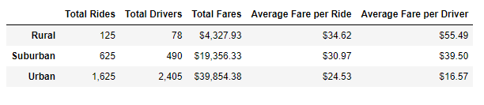
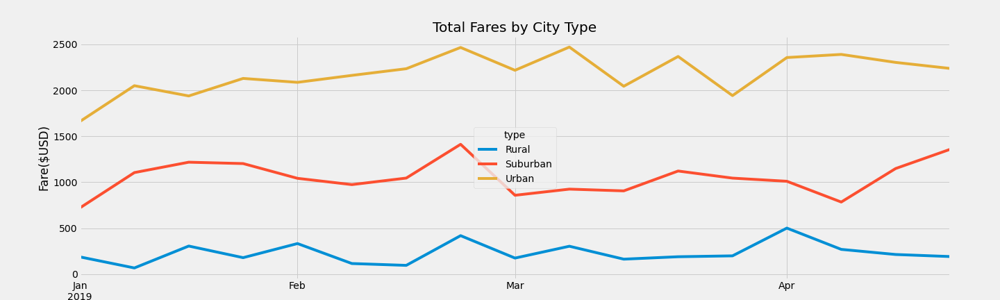

# Overview of the Analysis
This project analyzed a ride sharing data base. Aggregating ride-share data and creating an analysis of fares and riders in three key demographic areas (rural, suburban, urban) to determine affordability and profitability. 

# Results
The chart below condenses the ride sharing data. We can see the total number of rides, total number of drivers, total fares, average fare per rider and average fare per driver. From this chart we can ascertain:
- There are more riders and drivers in urban areas, 60% of all fares collected represent urban areas. 
- The average fare per ride is more expensive in rural areas. 
- The average fare per driver is more expensive in rural areas.
- Urban areas have the highest total riders, total drivers and the lowest average fares per driver and rider. 

The graph below provides a visualization of the data by types of areas. From this graph we can ascertain:
- The fares remain stable over time with our large fluctuations. 
- The highest profit area is the urban market.
- The number of total riders is 13% higher in urban areas compared to rurual areas. 

# Summary
- Based on the data results we see that urban fares have a lower average fare than suburban and rural fares. However, the key data that is missing is length of ride. Obtaining this data would increase our accuracy of analysis.
- Key market for expansion would be the suburban areas. The suburban drivers make up less than 13% of the total drivers, yet they take in 30% of the fares. By increasing the number of drivers in these areas would increase fares by making sure you have adequate drivers for the riders. 
- Targeting rural markets to bring down the cost of the fairs by increasing the number of drivers, may increase profitability. 
